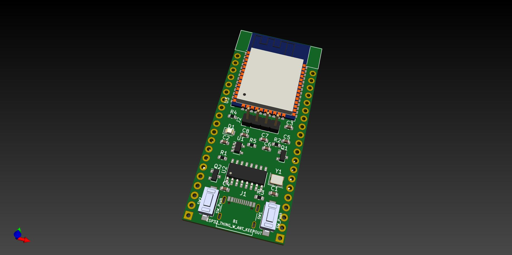
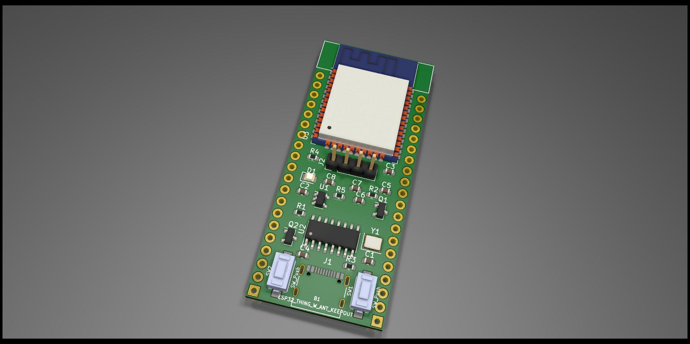
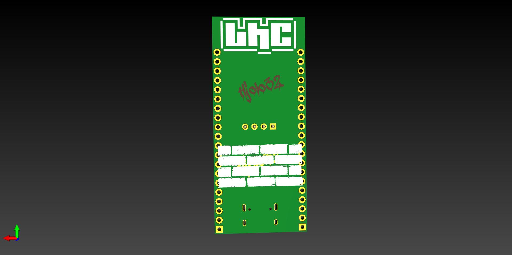

## PT-BR

# nodeLHC-ESP32 

  

LIVE em formato Hands On Construindo o nova versão da placa de desenvolvimento nodeLHC ESP32, com o Pedro Minatel, utilizando a ferramenta KIicad, o módulo escolhido é o ESP32 um microcontrolador de baixo custo da Espressif.

Em 2015 durante as oficinas de IoT no Hackerspace, criamos uma primeira versão do nodeLHC com o módulo ESP8266. Assim as pessoas aprenderam as diferentes etapas para construção de placa de circuitos impressos, também soldagem dos componentes da placa de desenvolvimento e programação para o módulo.

Descrições e detalhes:
Essa é uma primeira atividade que ao decorrer iremos construir novos projetos no formato aberto e colaborativo aproveitando a placa de desenvolvimento nodeLHC ESP32

- [KiCad](https://kicad-pcb.org/)
- [LHC KiCad Library](https://github.com/lhc/lhc_kicad_library)
- [Minatel KiCad Library](https://github.com/pedrominatel/minatel-kicad-libraries)
- [SparkFun KiCad Library](https://github.com/sparkfun/SparkFun-KiCad-Libraries)

# checklist
- [x] LIVE 1 - Explicação geral e desenho
- [x] LIVE 2 - Revisão esquemático e desenho da PCB parcial

# Próximos passados
- [ ] Lista de pessoas interessadas nos módulos
- [ ] Feedback comunidade
- [ ] LIVE 3 - Finalizar desenho da placa 
- [ ] Validar artes PCB
- [ ] Lista BOM
- [ ] Produção PCB

# Discourse 
Dúvidas? sugestões publicar na issues ou direto no discourse do LHC 

- [28/07/2020 LIVE - Hands On: Construindo o nodeLHC ESP32 com Kicad](https://discourse.lhc.net.br/t/28-07-2020-live-hands-on-construindo-o-nodelhc-esp32-com-kicad/148/2)
- [11/09/2020 LIVE - Hands On: Construindo o nodeLHC ESP32 com Kicad - Parte 02](https://discourse.lhc.net.br/t/11-09-2020-live-hands-on-construindo-o-nodelhc-esp32-com-kicad-parte-02/160)

# Ainda em construção 11/09/2020

# Log
- 19/08/2020 - Criado o evento, repositório, publicações nas redes sociais gerado link sobre a atividade.
- 02/09/2020 - Criado, divulgado o segundo evento, atualização de links no repositório.
- 06/10/2020 - Listagem das pessoas que responderam o discourse para receber o módulo ESP32

### Referencias

[ESP32 Datasheet](https://www.espressif.com/sites/default/files/documentation/esp32_datasheet_en.pdf)

[ESP32-WROOM Datasheet](https://www.espressif.com/sites/default/files/documentation/esp32-wroom-32d_esp32-wroom-32u_datasheet_en.pdf)

[ESP32 Design Guidelines](https://www.espressif.com/sites/default/files/documentation/esp32_hardware_design_guidelines_en.pdf)

[CH340G](https://cdn.sparkfun.com/datasheets/Dev/Arduino/Other/CH340DS1.PDF)
